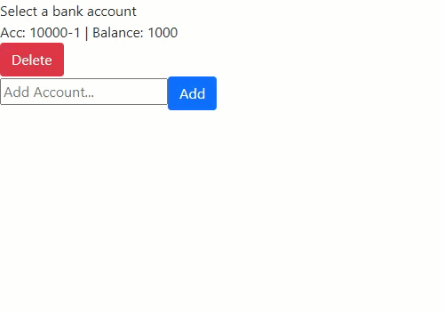

# ATM Machine

> Version 1.0.0.1

A project that resembles a basic ATM in which you can make money deposits and withdrawals

What is being **used** in this project:
- **React** to create the whole project

## What it does

1. Select or create an **Account** to make your **Transactions**.
1. Select the **Transaction mode** either **Deposit** or **Cash back**.
2. **Deposit mode** will add money to your balance, resembling your money deposit into your account.
3. **Cash back** will reduce your account's balance, resembling a money withdrawal.

## Maintainers
Who worked on this:
- [Simon Capriles](https://simoncapriles.github.io/)

## Support

Found some issues?  
Write to this email: <a href="mailto:info@kyohei.com.bo"><i class="font-icon icon-envelope"></i>info@kyohei.com.bo</a>

## Github

Want to download or fork the project?  
Find it on Github: [submit-form](https://github.com/SimonCapriles/submit-form)